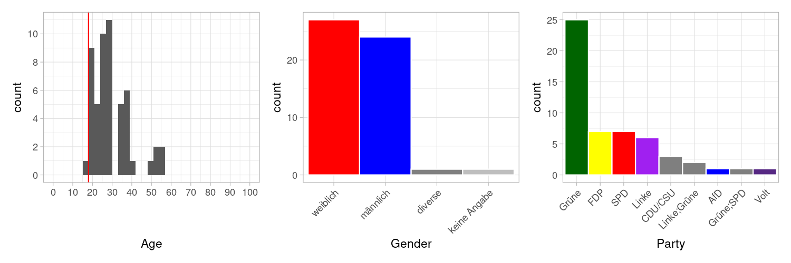

Experiment designed to elicit relevant social dimensions conveyed by our items.

# Design

Participants see two statements of a hypothetical politician and have to provide 4 attributes that describe that politician.  This is followed by a short demographics survey: age, gender, Sonntagsfrage.

## Stimuli
1. Volk:
  - Kinder sind die Zukunft unserer Gesellschaft. (control)
  - Kinder sind die Zukunft unseres Volkes. (dog whistle)
2. Staatsvolk:
  - Der Erwerb der deutschen Staatsbürgerschaft ist an strenge Bedingungen geknüpft. (control)
  - Die Aufnahme in das deutsche Staatsvolk ist an strenge Bedingungen geknüpft. (dog whistle)

# Implementation
Two Google forms:
1. https://docs.google.com/forms/d/1e8RyP0PCOeEia1Rzl49KEgVw2wC5jL6vHATUh_YFhcI/edit
2. https://docs.google.com/forms/d/1-Z-3APJWdMD13HwqlC-FhvDjaGhsTYtPybdqlZKYcTw/edit

# Participants
Data collection was on Prolific.  30 participants for each form.  Filters were:
- native language German
- resides in Germany
- didn’t live abroad for more than 6 months

Note: That participation in part (form 1) was not an exclusion criterion for the participation in the other part (form 2).  14 participants (or so) did both forms, which likely influenced the results (dog whistle more obvious in form 2).

## Demographics

# Analysis
The analysis is [here](scripts/analysis.R).

# Key findings
Based on visual inspection, Judith identified the following dimensions:

1. alt: jung
2. fortschrittlich: konservativ, traditionell, altmodisch, progressiv, bürgerlich, rückwärtsgewandt, zukunftsorientiert, weitsichtig, vorausschauend, zukunftsgewand
3. rassistisch: patriotisch, patriotistisch, nationalistisch, rechts, rassistisch, rechts/konservativ, xenophob
4. ehrlich: ehrlich, souverän, heuchlerisch, verantwortungsvoll, zuverlässig, vernünftig, kalkulierend
5. hilfsbereit: sozial, fair, altruistisch, geizig, intolerant, unmenschlich, offen, verschlossen, abweisend, egoistisch, engstirnig, ausschliessend, streng, strikt, dominant
6. intelligent: intelligent, gebildet, klug, kompetent, erfahren, selbstsicher
7. christlich: christlich
8. freundlich: freundlich, nett, unfreundlich, unsympatisch, kalt, schroff, sympatisch, warm, kritisch, zuversichtlich

Properties that don't appear relevant (e.g., about a different topic, not about the speaker): unkonventionell, stärkend, langweilig, nichtssagend, nachhaltig, redegewandt, fokussiert, kinderlieb, familiär, familienmensch, familienorientiert, familienfreundlich, kinderfreundlich, umweltbewusst, bürokratisch, juristisch, realistisch, informiert, mitdenkend.

# Obvervations, open problems, ideas
- Most participants were left-leaning.
- “Staatsvolk” item shows a dog whistle effect (more right/negative/konservative attributes).  Perhaps the dog whistle resolved the ambiguity in present in the control condition (not clear whether politician supports strict conditions on citizenship).  This finding is inconsistent with classic dog whistle definition (given that our participants were left-leaning).  But perhaps the overlap in participants: Perhaps the “Staatsvolk” item only showed a stronger effect because the dog whistle followed the control condition (form 1 was posted before form 2).

