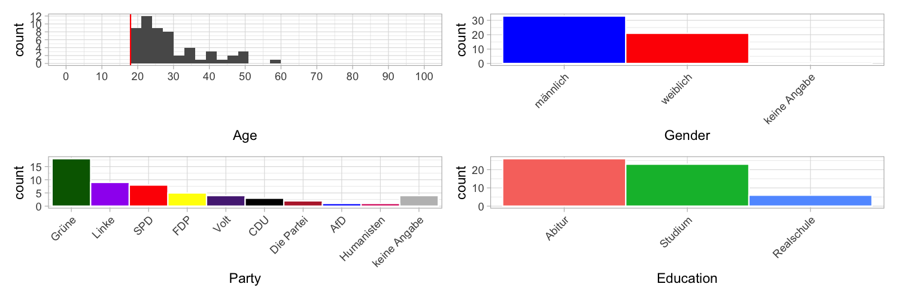

Experiment designed to test the relevant social dimensions identified in Pilot01.

# Design

Participants see two statements by two hypothetical politicians and had to rate them according to a number of attributes:

1. Age
2. “fortschrittlich”
3. “rassistisch”
4. “ehrlich”
5. “hilfsbereit”
6. “intelligent”
7. “christlich”
8. “freundlich”

In addition, participants had to guess to which party the politicians belong.  Then, participants had to indicate their age, gender, education level, and answer the Sonntagsfrage.  Next, participants had to indicate their agreement with 5 relevant items from the Wahl-O-Mat.  Finally, there was an opportunity to give free-form feedback. 

## Stimuli
1. Volk:
  - Kinder sind die Zukunft unserer Gesellschaft. (control)
  - Kinder sind die Zukunft unseres Volkes. (dog whistle)
2. Staatsvolk:
  - Der Erwerb der deutschen Staatsbürgerschaft ist an strenge Bedingungen geknüpft. (control)
  - Die Aufnahme in das deutsche Staatsvolk ist an strenge Bedingungen geknüpft. (dog whistle)

# Implementation
Two Google forms:
1. https://docs.google.com/forms/d/1Vc0JiXzEKk1aFr-4Vq1hk2YkYbqVvlTKHyOFFiegbW4/edit
2. https://docs.google.com/forms/d/1oRRfXS4IxwN4lS0LtcWYMezj8S4Pbo3u9l15eFQ8UvU/edit

# Participants
Data collection was on Prolific.  30 participants for each form.  Filters were:
- native language German
- resides in Germany
- didn’t live abroad for more than 6 months
- People who participated in previous pilots

## Demographics

# Analysis
The analysis is [here](scripts/analysis.R).

# Key findings

Question 1: What’s the impact of (presumed) dog whistles on how a hypothetical politician is evaluated?
- [Plots](generated/plots/social_dimensions.pdf)
- Summary: Dog whistles affects some dimensions (age, progressiveness, racism) but not much in others (christianity, friendlyness).  The clearest in effect is seen in party affiliation.  The effects differ depending on item.  For instance, the politician is perceived as older in the Zukunft-unseres-Volkes item, but there was no age difference in the Aufnahme-in-dt-Staatsvolk item (even in the control condition the age was estimated to be high, perhaps ceiling effect).

# Obvervations, open problems, ideas

- A next step should be to show that the evaluation depends on not just the use of a dog whistles but also on the participant’s identity.  However, the present data set likely provides insufficient data for that (very few conservative participants).  There are also many different ways in which such an analysis could be approached.  Need to think about which is most promising.

