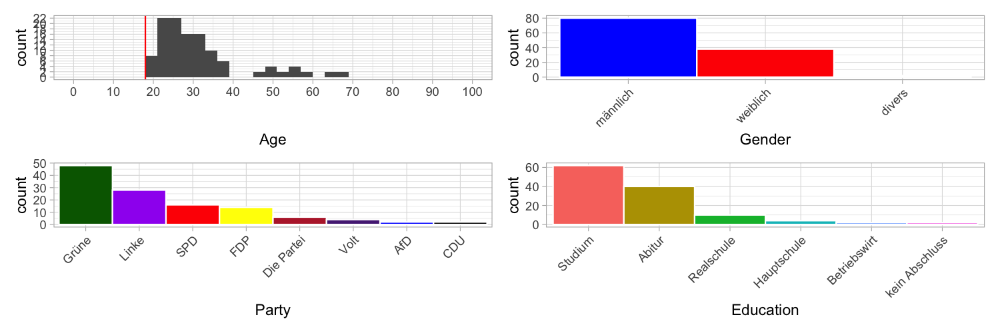

Experiment designed to test the relevant social dimensions for two potential DWs.

# Design

Participants see two statements by two hypothetical politicians and had to rate them according to a number of attributes:

1. Age
2. “fortschrittlich”
3. “rassistisch”
4. “ehrlich”
5. “hilfsbereit”
6. “intelligent”
7. “christlich”
8. “freundlich”

In addition, participants had to guess to which party the politicians belong.  Then, participants had to indicate their age, gender, education level, and answer the Sonntagsfrage.  Next, participants had to indicate their agreement with 5 relevant items from the Wahl-O-Mat.  Finally, there was an opportunity to give free-form feedback. 

## Stimuli
1. Diese Migrationspolitik sorgt für mehr Hilfe vor Ort in Krisenregionen. / Auch 2022 setzen wir uns weiter für Deutschland ein.
2. Diese Migrationspolitik sorgt für mehr lokale Unterstützung in Krisenregionen. / Auch 2022 geht unser Kampf für Deutschland weiter.

# Implementation

Two Google forms:
1. https://docs.google.com/forms/d/1RI9rx4cyMOL8d5PbNMNrYJxb2LlZrxpUgHN0RXHGcdY/edit
2. https://docs.google.com/forms/d/1TYgNg457cg8Oi-TIPrXeDBm55IIW68I9cEKDtZukwdk/edit

# Participants
Data collection was on Prolific.  30 participants for each form.  Filters were:
- native language German
- resides in Germany
- didn’t live abroad for more than 6 months
- For 2/2: People who participated in 1/2

## Demographics

# Analysis
The analysis is [here](scripts/analysis.R).

