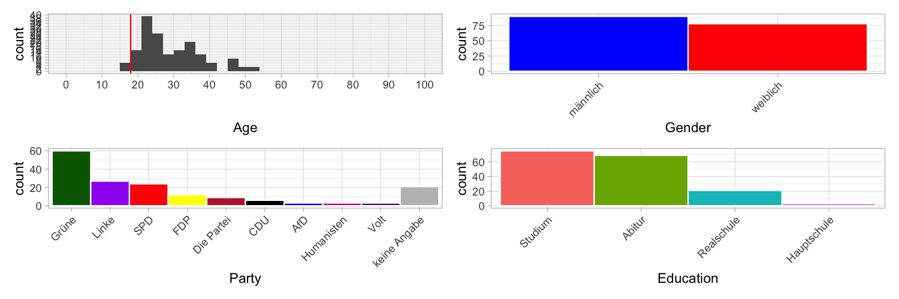

Experiment designed to test the plausibile deniability of the contents of the PDWs.

# Design

Participants see statements by hypothetical politicans and assess whether the statement is contradictory. Each participant sees one PDW and two control stimuli (one designed to be contradictory, one not contradictory).

Then, participants had to indicate their age, gender, education level, and answer the Sonntagsfrage.  Next, participants had to indicate their agreement with 5 relevant items from the Wahl-O-Mat.  Finally, there was an opportunity to give free-form feedback. 

## Stimuli

# Implementation

Two Google forms:
1. https://docs.google.com/forms/d/1RI9rx4cyMOL8d5PbNMNrYJxb2LlZrxpUgHN0RXHGcdY/edit
2. https://docs.google.com/forms/d/1TYgNg457cg8Oi-TIPrXeDBm55IIW68I9cEKDtZukwdk/edit

# Participants
Data collection was on Prolific.  30 participants for each form.  Filters were:
- native language German
- resides in Germany
- didn’t live abroad for more than 6 months
- For 2/2: People who participated in 1/2

## Demographics

# Analysis
The analysis is [here](scripts/analysis.R).

