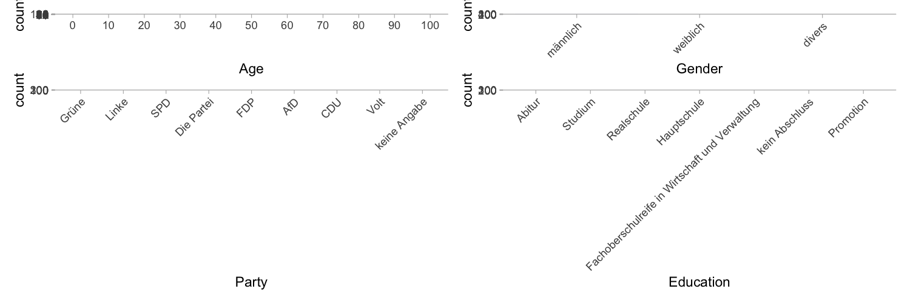

Experiment designed to test the plausibile deniability of the contents of the PDWs.

# Design

Participants see discourses by hypothetical politicans and other people, and assess whether the politician is contradictory. Each participant sees one PDW and two control stimuli (one designed to be contradictory, one not contradictory). The non-PDW minimal variants are also included, to be able to assess how much the at-issue content is contradicted.

Design based on this kind of example:

A: Angela Merkel is a kraut. 
B: What do you have against Germans? 
A: # I don’t have anything against Germans. I’m just talking about Merkel’s nationality.

Then, participants had to indicate their age, gender, education level, and answer the Sonntagsfrage.  Next, participants had to indicate their agreement with 5 relevant items from the Wahl-O-Mat.  Finally, there was an opportunity to give free-form feedback. 

## Stimuli

# Implementation

Six Google forms:
1/6: https://forms.gle/TWNkRY2nKWUSW1uz8
2/6: https://forms.gle/pqUXJfEdh72DRALeA
3/6: https://forms.gle/AMzox2DKXS7V9JoX9
4/6: https://forms.gle/W4yUU5zdchGzaTH4A
5/6: https://forms.gle/sqPwMYnFz8kgvUfN9
6/6: https://forms.gle/A6W8gPW84KUZ6hEH7

# Participants
Data collection was on Prolific.  30 participants for each form.  Filters were:
- native language German
- resides in Germany
- didn’t live abroad for more than 6 months
- For 2/2: People who participated in 1/2

## Demographics

# Analysis
The analysis is [here](scripts/analysis.R).

